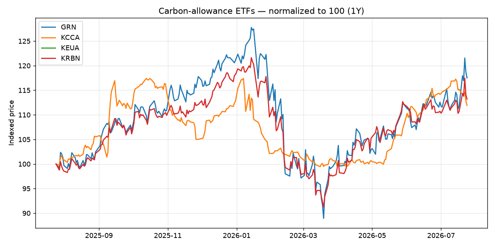

# Carbon Market Weekly — 2026-07-27

탄소배출권 시장 주간 브리핑 (EU ETS / 글로벌 / 캘리포니아 CCA 프록시).

## Snapshot

| ticker | last | ret_1w_% | ret_1m_% | vol_20d_ann_% | trend_vs_MA50 | signal |
| --- | --- | --- | --- | --- | --- | --- |
| GRN | 33.19 | 5.1 | 3.25 | 33.1 | UP | LONG |
| KCCA | 16.67 | -2.86 | -1.94 | 10.4 | UP | NEUTRAL |
| KEUA | 22.87 | 0.0 | 0.0 | 0.0 | n/a | STALE-DATA |
| KRBN | 33.9 | 2.26 | 1.22 | 23.8 | UP | LONG |

## Cross-market — EU vs California (relative value)

- KEUA/KCCA 비율 1.3719, 60일 z-score -0.46 → 중립 범위

## This week (draft)
- KRBN(글로벌/EU 배출권): LONG — 추세 UP, 1개월 1.22%
- (여기에 뉴스/정책 코멘트 2~3줄: EU ETS 정책, MSR, 경매 결과, K-ETS 동향 등)

> Signal 규칙: 50일 이동평균 추세 + 1개월 모멘텀 동조 시 LONG/AVOID, 불일치 시 NEUTRAL.
> 교육/리서치용. 투자 자문 아님.

---
*Data: Yahoo Finance (carbon-allowance ETFs). Free MVP pipeline — `carbon_report.py`.*