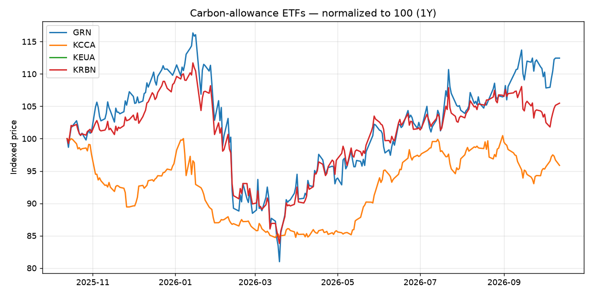

# Carbon Market Weekly — 2026-10-12

탄소배출권 시장 주간 브리핑 (EU ETS / 글로벌 / 캘리포니아 CCA 프록시).

## Snapshot

| ticker | last | ret_1w_% | ret_1m_% | vol_20d_ann_% | trend_vs_MA50 | signal |
| --- | --- | --- | --- | --- | --- | --- |
| GRN | 34.88 | 4.17 | 1.53 | 20.9 | UP | LONG |
| KCCA | 16.76 | -0.68 | -0.62 | 11.3 | DOWN | SHORT/AVOID |
| KRBN | 34.4 | 3.61 | -0.81 | 17.9 | UP | NEUTRAL |

## Cross-market — EU vs California (relative value)

- (KEUA/KCCA 데이터 부족)

## This week (draft)
- KRBN(글로벌/EU 배출권): NEUTRAL — 추세 UP, 1개월 -0.81%
- (여기에 뉴스/정책 코멘트 2~3줄: EU ETS 정책, MSR, 경매 결과, K-ETS 동향 등)

> Signal 규칙: 50일 이동평균 추세 + 1개월 모멘텀 동조 시 LONG/AVOID, 불일치 시 NEUTRAL.
> 교육/리서치용. 투자 자문 아님.

---
*Data: Yahoo Finance (carbon-allowance ETFs). Free MVP pipeline — `carbon_report.py`.*